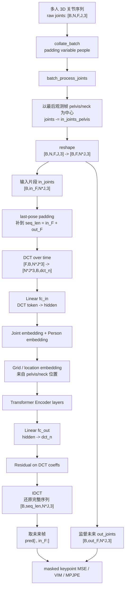
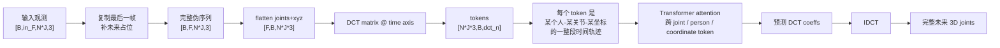
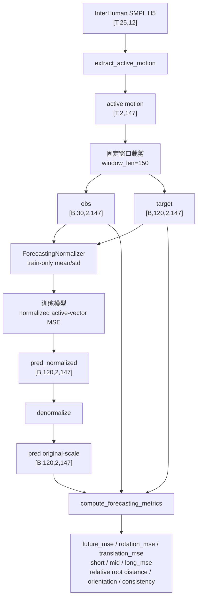
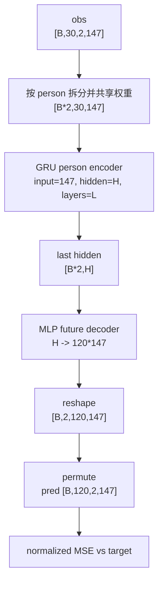
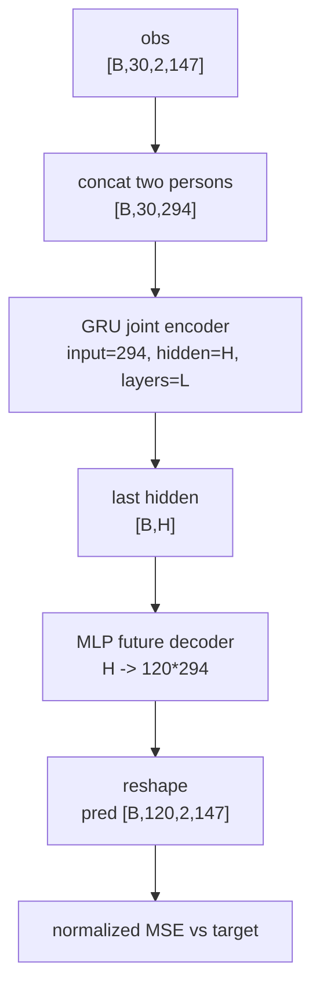
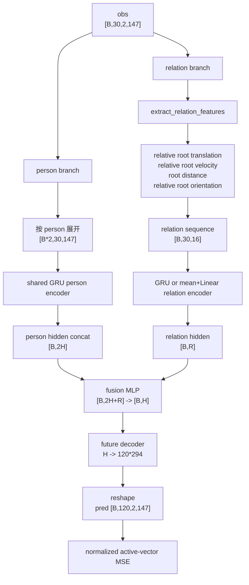
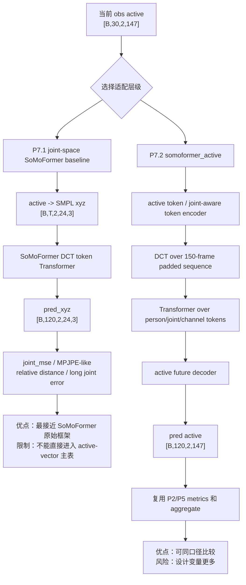

# SoMoFormer 与当前双人预测模型组件图

## 图 1：SoMoFormer 原始模型总览

## 图 2：SoMoFormer 的 token 化与 DCT 细节

## 图 3：当前 ReGenNet 双人 forecasting 数据与评估闭环

## 图 4：当前 independent baseline 组件图

## 图 5：当前 concat no-relation baseline 组件图

## 图 6：当前 relation-aware model 组件图

## 图 7：SoMoFormer-style 适配到当前任务的推荐路线

## 关键边界

- SoMoFormer 原版是 3D joint coordinate trajectory model，不是 rot6d / SMPL parameter model。
- 当前 ReGenNet 主表是 active-vector original-scale 指标；joint-space SoMoFormer baseline 不能直接替代 P5 主表。
- 如果目标是论文可比较结果，最终需要 `somoformer_active` 输出 `[B,120,2,147]`，并和 independent / concat / relation-aware 同口径比较。
