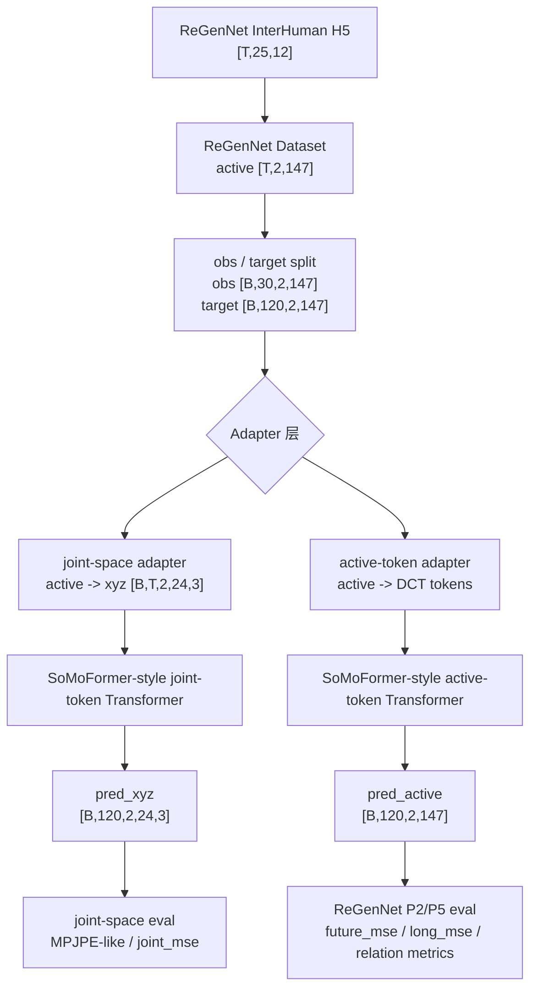
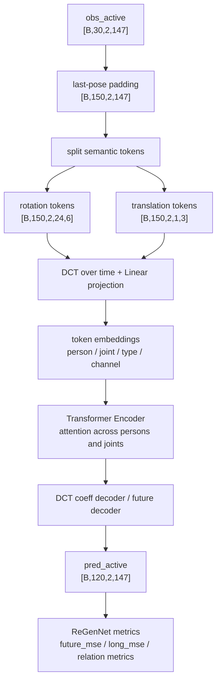

# SoMoFormer 思想迁入 ReGenNet forecasting pipeline 的设计说明

## 用户问题

用户追问：两个项目数据集格式不同，如何把 SoMoFormer 模型思想迁入 ReGenNet 的 forecasting pipeline。

## 一句话设计

不迁移 SoMoFormer 的数据集格式和训练入口，只迁移它的核心建模思想：

```text
把每个人-每个关节-每个坐标的一整段时间轨迹作为 token，
用 DCT 压缩时间维，
再用 Transformer 在 joint / person token 间做 attention。
```

ReGenNet 仍保留自己的：

```text
InterHuman H5 -> active vector -> 150/30/120 split -> normalizer -> evaluator -> aggregate
```

格式差异由 adapter 层解决，而不是让 SoMoFormer 原仓库直接读取 ReGenNet 数据。

## 两边数据格式差异

### SoMoFormer 原始格式

```text
raw: [B,N,F,J,3]
processed input: [B,in_F,N*J,3]
target: [B,out_F,N*J,3]
semantics: 3D joint coordinates
default: in_F=16, out_F=14, J=13
```

模型假设：

- 最后一维 `3` 是真实空间 xyz。
- token 是 `person-joint-coordinate trajectory`。
- DCT 作用在时间维。
- attention 作用在 joint/person/coordinate token 之间。

### ReGenNet 当前 forecasting 格式

```text
raw H5: [T,25,12]
active: [T,2,147]
obs: [B,30,2,147]
target: [B,120,2,147]
semantics: 每个人 24 个 SMPL rot6d + root translation
```

模型和指标假设：

- `147 = 24*6 + 3`。
- 主要 loss 是 normalized active-vector MSE。
- 主表指标在 original-scale active vector 上计算。
- relation metrics 使用 root translation / root orientation。

## 不能直接做什么

### 不能把 `[B,30,2,147]` reshape 成 SoMoFormer 的 `[B,F,N*J,3]`

原因：

```text
rot6d 不是 xyz。
147 维里前 144 维是旋转表示，只有最后 3 维是 translation。
把 rot6d 每 3 维当坐标，会让 SoMoFormer 的空间 token 语义失效。
```

这类实现虽然能跑 tensor shape，但不是合理模型。

### 不能直接替换成 SoMoFormer 原 evaluator

原因：

```text
SoMoFormer 原 evaluator 是 VIM / MPJPE / 3DPW / SoMoF 口径。
当前论文主表是 ReGenNet InterHuman 150/30/120 active-vector 口径。
直接换 evaluator 会导致结果不能和 P5 independent / concat / relation 对比。
```

## 迁移设计分层



## 阶段 1：joint-space SoMoFormer baseline

### 目标

先验证 SoMoFormer 的原始归纳偏置在 InterHuman 双人数据上是否有效。

### 输入转换

从 ReGenNet active vector：

```text
obs_active: [B,30,2,147]
target_active: [B,120,2,147]
```

用 SMPL forward 转为 joint-space：

```text
obs_xyz: [B,30,2,24,3]
target_xyz: [B,120,2,24,3]
```

转换依据：

```text
active[..., :144] -> 24 joints rot6d
active[..., 144:147] -> root translation
model/rotation2xyz.py + model/smpl.py -> SMPL joints
```

### 模型输入

将 `obs_xyz` reshape 成 SoMoFormer 风格：

```text
[B,30,2,24,3] -> [B,30,48,3]
```

其中：

```text
N = 2
J = 24
K = 3
N*J = 48
```

### 模型核心

```text
last-pose padding 到 150 帧
-> flatten 为 [150,B,2*24*3]
-> DCT over time
-> token [2*24*3,B,dct_n]
-> joint embedding + person embedding + optional location embedding
-> Transformer Encoder
-> DCT coeff decoder
-> IDCT
-> pred_xyz [B,120,2,24,3]
```

### Loss / Eval

训练 loss：

```text
MSE(pred_xyz, target_xyz)
```

评估：

```text
joint_mse
MPJPE-like
root_translation_error
relative_root_distance_error
long_horizon_joint_mse
```

### 优点

- 最贴近 SoMoFormer 原论文。
- 数据格式差异由 SMPL forward adapter 解决，模型仍使用真实 xyz token。
- 能快速判断 joint/person token Transformer 是否值得继续投入。

### 局限

- 输出是 xyz，不是 rot6d。
- 不能直接进入当前 P5 active-vector 主表。
- 不能报告 `rotation_mse`。

## 阶段 2：somoformer_active 同口径版本

### 目标

让 SoMoFormer-style 模型直接输出 ReGenNet active vector：

```text
pred_active: [B,120,2,147]
```

这样才能复用当前：

```text
compute_forecasting_metrics
eval/eval_forecasting.py --mode checkpoint
eval/eval_forecasting.py --mode aggregate
```

### 设计思路

保留 ReGenNet 的输入输出 contract：

```text
input: obs_active [B,30,2,147]
output: pred_active [B,120,2,147]
loss: normalized active-vector MSE
```

但中间编码借鉴 SoMoFormer：

```text
obs_active -> 150-frame padded sequence
-> 按 person / joint / channel 分 token
-> DCT over time
-> token embeddings
-> Transformer over tokens
-> IDCT or direct future decoder
-> active future
```

### 推荐 token 设计

不建议把 147 维扁平 token 当作 `49*3` 坐标。建议显式保留 SMPL 语义：

```text
rotation tokens: [person, joint, rot6d-dim]
translation tokens: [person, root_translation_dim]
optional xyz auxiliary tokens: active -> xyz -> [person, joint, xyz]
```

第一版可以简化为：

```text
token axis = person * active_dim = 2 * 147
但 embedding 必须区分 person、joint slot、feature type(rot/trans)、feature channel
```

更合理的第二版：

```text
rotation token = one SMPL joint trajectory with 6D feature
translation token = root translation trajectory with 3D feature
token count = 2 * (24 rotation tokens + 1 translation token) = 50 tokens
token feature = DCT coefficients of 6D or 3D feature projected to hidden
```

第二版比 `2*147` token 更干净，因为 token 语义是“一个 joint 的整段旋转轨迹”，不是孤立标量。

### Mermaid 结构



### Loss 设计

第一版：

```text
loss = MSE(pred_active_normalized, target_active_normalized)
```

第二版可加辅助 loss：

```text
loss = active_mse + lambda_xyz * joint_xyz_mse
```

其中：

```text
pred_active -> SMPL forward -> pred_xyz
target_active -> SMPL forward -> target_xyz
```

辅助 loss 的目的不是替代 active loss，而是给 SoMoFormer-style joint inductive bias 更强的空间监督。

## 为什么这样能处理数据集格式不同

核心是三层解耦：

### 1. Dataset contract 不变

ReGenNet dataset 仍只负责输出：

```text
obs_active, target_active, meta
```

不让 SoMoFormer 的 3DPW / SoMoF loader 进入 ReGenNet 主路径。

### 2. Adapter 只做表示转换

adapter 负责把 active-vector 转成模型需要的内部表示：

```text
active -> xyz
active -> semantic DCT tokens
active -> relation/location embeddings
```

adapter 不改变 sample split、normalizer、train/test 协议。

### 3. Evaluator contract 不变

只要最终模型输出 `pred_active [B,120,2,147]`，就能继续用原 evaluator。

如果模型只输出 xyz，则它只能作为 joint-space diagnostic baseline，不能作为 P5 主表模型。

## 最小实现建议

### P7.0 adapter smoke

新增：

```text
utils/forecasting_xyz.py
eval/eval_forecasting.py --mode xyz_smoke 或独立 smoke 脚本
```

验证：

```text
active -> xyz finite
shape: [B,30,2,24,3] / [B,120,2,24,3]
root translation 与 active translation 方向一致
```

### P7.1 joint-space model

新增：

```text
model/forecasting_somoformer.py
train/train_forecasting_xyz.py
eval/eval_forecasting_xyz.py
```

不改：

```text
train/train_forecasting.py
eval/eval_forecasting.py 的 P2/P5 指标行为
```

### P7.2 active-vector model

扩展：

```text
model/forecasting.py -> 增加 somoformer_active 或单独模块后在 factory 注册
train/train_forecasting.py -> 增加 model_type choice
eval/eval_forecasting.py -> checkpoint loading 兼容新 model_type
```

验收：

```text
dataset smoke
2-step training smoke
checkpoint eval smoke
metrics_sanity 回归
3-seed aggregate 对比 independent / concat / relation
```

## 设计边界

- 不能声称复现 SoMoFormer 原论文结果，因为数据集、帧协议、joint set 和指标都不同。
- 可以声称实现了 SoMoFormer-style joint/person trajectory-token Transformer baseline。
- 如果只做 joint-space baseline，论文中只能作为补充分析或模型探索。
- 如果要进入主结论，必须做 active-vector 输出并同口径报告 P5 metrics。
