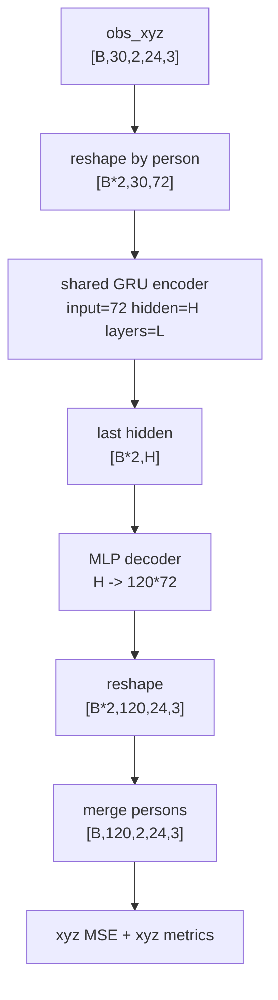

# P7 independent_pair_xyz baseline 设计文档

## 背景

P7.1 已完成 SoMoFormer XYZ baseline：

```text
input:  obs_xyz [B,30,2,24,3]
output: pred_xyz [B,120,2,24,3]
loss:   xyz MSE
```

test 结果：

```text
joint_mse=0.0596641728
mpjpe=0.2897213449
long_joint_mse=0.1165986784
relative_root_distance_error=0.1982787535
```

但目前还缺一个真正公平的 joint-space independent baseline。旧 P3 independent 是 active-vector 模型：

```text
input/output: [B,T,2,147]
loss: active-vector MSE
```

把它转成 xyz 评估只能作为参考，不能作为公平结构对比。

## 用户修正

用户指出：baseline 不应该理解为“训练一个单人的预测模型”，而应该仍然使用同一个双人样本，只是在模型内部把两个人单独预测，最后再合在一起。

这是正确的。后续命名采用：

```text
independent_pair_xyz
```

而不是模糊的 `xyz-independent baseline`。

## 研究问题

`independent_pair_xyz` 回答的问题是：

```text
在同样的 InterHuman 双人样本和 xyz loss 下，
如果模型完全不允许两个人之间的信息流，
只让每个人根据自己的过去预测自己的未来，
效果是多少？
```

它是 SoMoFormer XYZ 的关键对照：

```text
independent_pair_xyz: 不看对方
somoformer_xyz: joint/person token attention，可以看对方
```

如果 SoMoFormer XYZ 不能优于 independent_pair_xyz，则不能说明 joint/person cross-person token attention 有效。

## 数据协议

使用当前 P7.1 已实现的 active -> xyz adapter：

```text
InterHumanForecastDataset
obs_active:    [B,30,2,147]
target_active: [B,120,2,147]

active_to_xyz
obs_xyz:       [B,30,2,24,3]
target_xyz:    [B,120,2,24,3]
```

不新增数据集，不改变 split，不缓存 H5 作为第一步。

## 模型 contract

### 输入输出

```text
input:  obs_xyz  [B,30,2,24,3]
output: pred_xyz [B,120,2,24,3]
```

### 信息流限制

模型内部：

```text
obs_xyz [B,30,2,24,3]
-> 分人展开 [B*2,30,24,3]
-> 每个人独立预测 [B*2,120,24,3]
-> 拼回 [B,120,2,24,3]
```

严格禁止：

- person0 编码时看到 person1 的任何观测；
- person1 编码时看到 person0 的任何观测；
- 两个人 hidden state 融合；
- relation feature；
- cross-person attention。

允许：

- 两个人共享同一个预测器权重。

共享权重是合理的，因为两个人都是人体运动；同时能避免两个独立模型导致参数量翻倍。

## 模型结构建议

第一版采用 GRU + MLP，和旧 P3 independent 思路对齐，但输出 xyz：



推荐默认：

```text
hidden_dim=256
num_layers=2
batch_size=32
num_steps=5000
lr=1e-3 或 3e-4
weight_decay=1e-4
seed=0
num_workers=0
```

`lr` 建议先用 `1e-3`，因为 GRU+MLP 规模较小，和 P3 active independent 默认一致。如果 loss 不稳定，再改 `3e-4`。

## 参数量和公平性

默认参数量预计远小于 SoMoFormer XYZ：

```text
SoMoFormer XYZ: 3,182,110 params
independent_pair_xyz GRU H=256 L=2: 约 1-3M params
```

这个 baseline 的目的不是参数量匹配，而是回答“完全不看对方是否已经足够好”。如果 independent_pair_xyz 很强，再做 parameter-matched xyz baseline 或 transformer independent baseline。

## 文件改动设计

### 方案 A：复用现有 P7 文件，扩展最小

修改：

```text
model/forecasting_somoformer.py
train/train_forecasting_xyz.py
eval/eval_forecasting_xyz.py
```

新增 model type：

```text
independent_pair_xyz
somoformer_xyz
```

优点：

- 复用现有 xyz train/eval。
- checkpoint / metrics 输出一致。

缺点：

- 文件名 `forecasting_somoformer.py` 会变得不只包含 SoMoFormer。

### 方案 B：新增通用 xyz 模型文件

新增：

```text
model/forecasting_xyz.py
```

迁移或导入：

```text
JointSpaceSoMoFormer
IndependentPairXYZModel
create_xyz_forecasting_model
create_xyz_forecasting_model_from_config
XYZ_MODEL_TYPES
```

修改：

```text
train/train_forecasting_xyz.py
eval/eval_forecasting_xyz.py
```

优点：

- 语义更清晰，P7 后续 concat_xyz / relation_xyz 也有地方放。

缺点：

- 需要多一点重构。

## 推荐

采用方案 B。

原因：

P7 接下来很可能还会有：

```text
concat_xyz
relation_xyz
parameter-matched xyz baseline
```

把它们都塞进 `forecasting_somoformer.py` 会让命名不准确。更合理的是新增 `model/forecasting_xyz.py`，让 `forecasting_somoformer.py` 只保留 SoMoFormer 组件，或由 `forecasting_xyz.py` 统一导出。

第一步可不移动已有类，只在 `model/forecasting_xyz.py` 中 import：

```python
from model.forecasting_somoformer import JointSpaceSoMoFormer
```

再新增 `IndependentPairXYZModel` 和 factory。

## 训练命令建议

```text
micromamba run -p /home/rpartx3080/.local/micromamba/envs/regennet python -m train.train_forecasting_xyz \
  --data_path dataset/interhuman/smpl/conditioned \
  --save_dir save/forecasting/interhuman/p7_independent_pair_xyz_h256_l2_s0_5000 \
  --model_type independent_pair_xyz \
  --batch_size 32 \
  --eval_batch_size 32 \
  --num_steps 5000 \
  --save_interval 1000 \
  --eval_interval 500 \
  --hidden_dim 256 \
  --num_layers 2 \
  --lr 1e-3 \
  --weight_decay 1e-4 \
  --num_workers 0 \
  --seed 0
```

需要给 `train_forecasting_xyz.py` 增加：

```text
--model_type independent_pair_xyz|somoformer_xyz
```

并让 SoMoFormer 的参数保留：

```text
--dct_n
--num_heads
--dim_feedforward
--dropout
```

independent_pair_xyz 不使用这些参数，但可以保留在 args 里。

## 评估与汇总

使用同一个 `eval/eval_forecasting_xyz.py --mode checkpoint`。

输出：

```text
metrics_test.json
metrics_test.yaml
```

再更新：

```text
results/forecasting/interhuman/p7_xyz_compare_active_baselines/
```

或新增更准确的：

```text
results/forecasting/interhuman/p7_xyz_main_seed0/
```

建议新的 seed0 主对比表：

```text
repeat_xyz
independent_pair_xyz
somoformer_xyz
```

后续再加：

```text
concat_xyz
relation_xyz
```

## 验收顺序

### 1. compile

```text
python -m compileall model/forecasting_xyz.py train/train_forecasting_xyz.py eval/eval_forecasting_xyz.py
```

### 2. model forward smoke

```text
obs_xyz [2,30,2,24,3] -> pred_xyz [2,120,2,24,3]
```

### 3. 2-step training smoke

```text
num_steps=2
max_samples=2
checkpoint eval pass
```

### 4. active-vector 主路径回归

继续跑：

```text
eval.eval_forecasting --mode metrics_sanity
```

确认 P1-P6 不漂移。

### 5. seed0 5000-step 正式训练

训练完成后记录：

- checkpoint path
- params
- test metrics
- 和 SoMoFormer XYZ 的差距

## 结果解释

如果：

```text
somoformer_xyz < independent_pair_xyz
```

尤其在：

```text
long_joint_mse
relative_root_distance_error
```

上明显更低，则支持：

```text
joint/person cross-token interaction modeling 在 joint-space forecasting 中有收益。
```

如果：

```text
independent_pair_xyz <= somoformer_xyz
```

则说明当前 SoMoFormer-style cross-person attention 未证明优于两人独立预测，后续不应继续把它包装成 interaction-aware 改进。

## 边界

该实验仍是 joint-space 口径，不是 active-vector 主表。即使 SoMoFormer XYZ 赢了 independent_pair_xyz，也只能说明：

```text
joint-space forecasting 下 cross-person token modeling 有收益。
```

要写入当前论文主表，仍需 P7.2 `somoformer_active` 或 active-vector 同口径实现。
